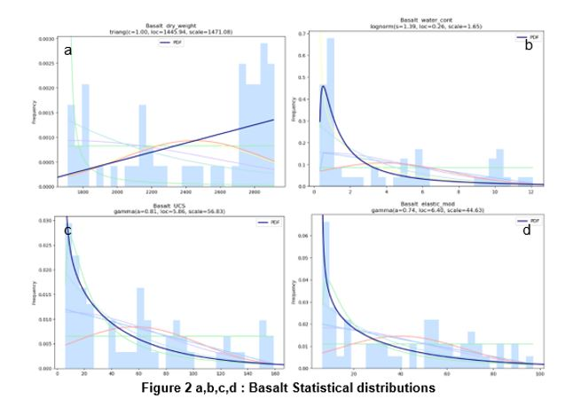
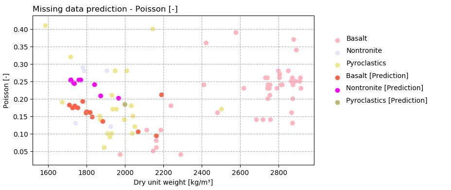
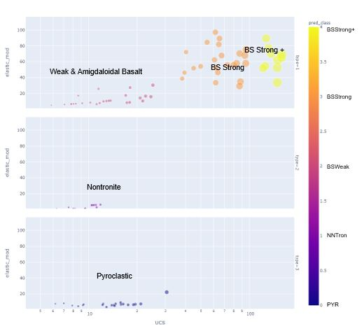
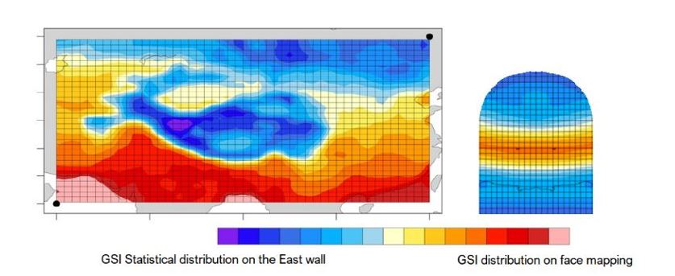

# Machine Learning for Geomechanical Characterization of Rock
This code will guide you through the geomechanical characterization of various types of rocks by mean of Machine learning algorithms applied to predict missing parameters and KMeans classificator algorithm to classify rocks. 

Finally, the cherry on the cake: we will make use of Statistics and Machine Learing algoritm to distribute parameters on surfaces, by mixing face mapping informations an laboratory tests results.

